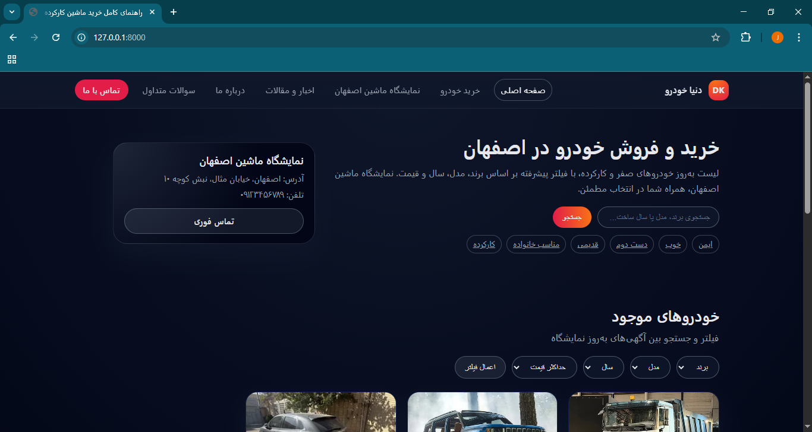
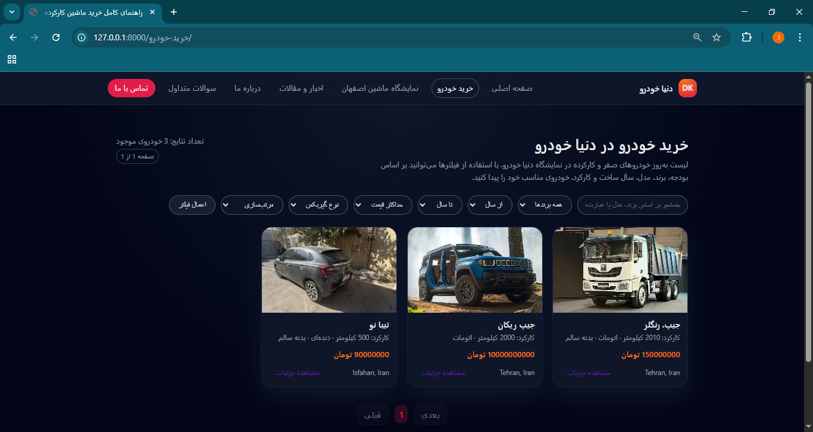
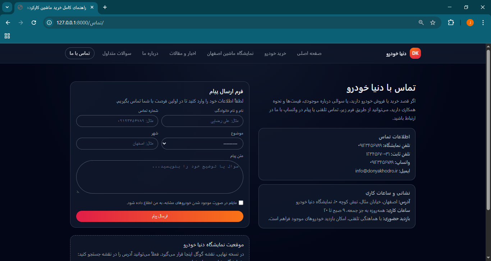

#car-dealership-website-django


A full-featured car dealership website built with Django, designed for Persian-speaking users with SEO-friendly structure, advanced filtering, tagging, and admin management.


## ✨ Features

- Car listing with advanced filters (brand, year, price, mileage, gearbox)
- SEO-friendly URLs and slugs
- Car detail pages with image gallery
- Tag-based car browsing
- Articles & blog system with categories and tags
- Fully functional Django admin panel
- Contact form with database storage
- RTL & Persian language support
- Responsive and modern UI


## 📸 Screenshots

### Home Page


### Cars Listing


### Car Detail Page


### Articles


### ContactUs


### AboutUS


  


  ## 🛠 Tech Stack

- Python 3
- Django
- HTML5 / CSS3
- JavaScript
- SQLite (development)
- Django Admin
 


 ## 🚀 Installation

1. Clone the repository:
bash```
git clone https://github.com/boroomandroozbeh/car-dealership-website-django.git


pip install -r requirements.txt


python manage.py migrate


python manage.py createsuperuser


python manage.py runserver


---

## 7. Usage
```md
## 📌 Usage

- Access the admin panel at `/admin`
- Add brands, cars, tags, and articles from the admin panel
- Uploaded images are stored locally during development


## 🔮 Future Improvements

- Online car reservation
- Advanced search with Elasticsearch
- REST API for mobile apps
- Production deployment (Docker, Nginx)


## 👨‍💻 About This Project

This project was built as a professional portfolio piece and can be customized for real-world car dealerships.


 ## 🚀 Installation
